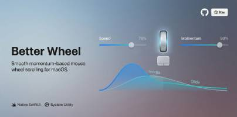

# Better Wheel

<!-- Banner Placeholder - Add your banner image here -->

> Transform your mouse wheel scrolling experience on macOS with smooth, customizable momentum scrolling.

---

## Overview

**Better Wheel** is a native macOS application that enhances your mouse wheel scrolling experience by adding smooth momentum-based scrolling with customizable speed and glide effects. Say goodbye to choppy, unnatural scrolling and enjoy a fluid, responsive experience that feels just right for your workflow.

Whether you prefer precise, responsive control or smooth gliding like you're skating on ice, Better Wheel gives you complete control over your scrolling behavior.

https://github.com/user-attachments/assets/4246dabb-647f-4e7f-9e08-2b746376b493

---

## ✨ Features

### 🎯 Core Features
- **Smooth Momentum Scrolling** - Transform choppy mouse wheel input into fluid, natural scrolling
- **Customizable Speed** - Adjust scroll speed from 0.5x to 3.0x with precise control
- **Adjustable Momentum** - Fine-tune the glide/inertia effect from precise (0% glide) to smooth skating (100% glide)
- **Invert Scroll Direction** - Toggle between natural and traditional scrolling directions
- **Launch at Login** - Automatically start Better Wheel when your Mac boots up

### 🛡️ System Integration
- **Accessibility Permission Management** - Seamless permission handling with clear UI guidance
- **Real-time Permission Monitoring** - Automatically responds to permission changes
- **Menu Bar Integration** - Quick access to settings and controls from the menu bar
- **Native macOS Design** - Built with modern macOS design principles and materials

### 🎨 User Experience
- **Intuitive UI** - Clean, card-based interface with visual feedback
- **Live Preview** - See changes instantly as you adjust settings
- **Smart Defaults** - Optimized default settings that work great out of the box
- **Contextual Help** - Clear labels and descriptions for every setting

---

## 🛠 Technology & Languages Used

### Languages
- **Swift** - 100% Swift codebase leveraging modern Swift features
- **SwiftUI** - Declarative UI framework for building the entire interface

### Frameworks & APIs
- **AppKit** - macOS application foundation and window management
- **Quartz** - Core Graphics event monitoring and manipulation
- **CoreGraphics (CGEvent)** - Low-level event handling for scroll interception
- **ServiceManagement** - Launch at login functionality
- **Accessibility API** - System-wide scroll event monitoring
- **Combine** - Reactive programming for state management
- **UserDefaults** - Persistent settings storage

### Key Technologies
- **Event Monitoring** - Global event tap for intercepting scroll events
- **Smooth Animation** - Custom interpolation algorithms for momentum scrolling
- **Permission Management** - Accessibility permission checking and UI flow
- **Menu Bar App** - NSStatusBar integration with SwiftUI views

### Development Tools
- **Xcode** - Primary IDE
- **Swift Package Manager** - Dependency management (if applicable)
- **macOS SDK** - Native macOS development

---

## 📋 Requirements

- **macOS 13.0 (Ventura)** or later
- **Accessibility Permissions** - Required for monitoring scroll events
- Compatible with any mouse or trackpad

---

## 🚀 Installation

### Download
1. Download the latest release from the [Releases](https://github.com/masooddalman/Better-Wheel/releases) page
2. Open the downloaded `.dmg` file
3. Drag **Better Wheel** to your Applications folder
4. Launch Better Wheel from Applications

### First Launch
1. Open **Better Wheel**
2. Click **"Grant Permission"** when prompted
3. Enable **Better Wheel** in **System Settings > Privacy & Security > Accessibility**
4. Return to Better Wheel and toggle it **ON**
5. Customize your scrolling experience!

---

## 🎮 Usage

### Quick Start
1. **Enable Better Wheel** - Toggle the main switch to ON
2. **Adjust Speed** - Use the Speed slider (🐢 to 🐇) to set your preferred scroll speed
3. **Set Momentum** - Use the Momentum slider (👆 to 🛹) to control the glide effect
4. **Optional Settings**:
   - Enable "Launch at Login" to start automatically
   - Toggle "Invert Scroll Direction" if needed

### Understanding Momentum

The Momentum slider controls how much "glide" your scrolling has:

- **Precise (0-34%)** - Immediate response, stops exactly where you want
  - 100% Precise = No glide, direct control
  - Perfect for: Spreadsheets, code editing, precise work

- **Balanced (35-65%)** - The sweet spot for most users
  - Combines responsiveness with smooth feel
  - Perfect for: General browsing, document editing

- **Glide (66-100%)** - Smooth, flowing scrolling with momentum
  - 100% Glide = Maximum "sliding on ice" effect
  - Perfect for: Reading long articles, social media feeds

---

## 🔒 Privacy

Better Wheel respects your privacy:
- **No Data Collection** - We don't collect any user data
- **No Network Access** - All processing happens locally on your Mac
- **Open Source** - Transparent codebase you can review
- **Accessibility Only** - Only uses permissions necessary for scroll enhancement

---

## 🤝 Contributing

Contributions are welcome! Here's how you can help:

1. Fork the repository
2. Create a feature branch (`git checkout -b feature/amazing-feature`)
3. Commit your changes (`git commit -m 'Add amazing feature'`)
4. Push to the branch (`git push origin feature/amazing-feature`)
5. Open a Pull Request

---

## 💬 Support

Having issues? Here's how to get help:

- **Bug Reports** - [Open an issue](https://github.com/masooddalman/Better-Wheel/issues)
- **Feature Requests** - [Start a discussion](https://github.com/masooddalman/Better-Wheel/issues)
- **Questions** - Check existing issues or start a new discussion

---

## 🙏 Acknowledgments

- Built with ❤️ using Swift and SwiftUI
- Inspired by the need for better mouse wheel control on macOS

  Made with ❤️ by MasoodDalman

  <a href="#better-wheel">Back to Top ⬆️</a>

